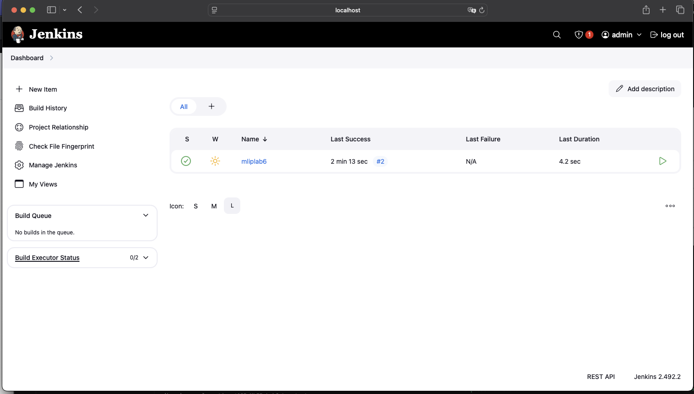
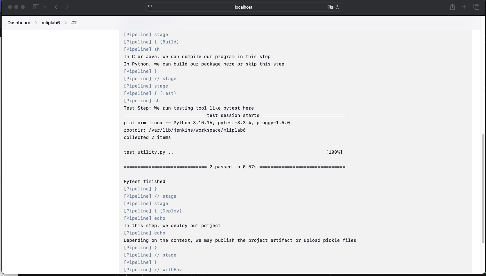

# Lab 6 - Continuous Integration with Jenkins

In this lab, you will explore how to perform Continuous Integration(CI) using Jenkins. You are highly recommended to use team virtual machine for this lab. </br>
Jenkins has a wide range of functionalities that facilitate the software development process. In this lab, we will focus on the Continuous Integration aspect, which means updates to the code base are continuously tested to ensure the program's quality.</br>
The testing tool we use is [pytest](https://docs.pytest.org/en/7.1.x/index.html). It is a light weight tool that collect test cases automatically. 
To receive credit for this lab, show your work to the TA during recitation.

## Deliverables
- [ ] Show correct configuration of a Jenkins pipeline on **forked [Lab6 Github Repo](https://github.com/pedrogbmendes/MLIP_Lab6/)**. The build process must automatically fetch Jenkinsfile and run pipeline according to it.
- [ ] Complete the `jenkinsfile` to make the Jenkins pipeline test the repo during each build. Explain your understanding of what the given Jenkinsfile does.
- [ ] Complete the `test_data_split` function in `test_utility.py` to test data split step.


## Environment Set Up
Since we recommend you to use team server, your teammate may already finish this step on your team server. **$${\color{red}Please \space do \space not \space install \space Java \space and \space Jenkins \space again \space if \space your \space teammate \space have \space already \space done \space it.}$$**
Since Jenkins has many installation options, please communicate with your teammate to settle down a way you prefer. This lab recommends install Jenkins as a system service using JVM but the final choice is yours. </br> What's more, please strictly keep your credentials of Jenkins secret from anyone outside your group. Our team server has public IP and malicious attacker can cause significant harm to your VM by breaching Jenkins.

To check if Java or Jenkins are installed in your team server, you can run in the terminal `java --version` and `jenkins --version`. 
You can also install these on your computer to test this lab.

### Java Installation
- Go to [Jenkins Installation Page](https://www.jenkins.io/doc/book/installing/), select the Operating System you currently use. For your team server, please select [linux](https://www.jenkins.io/doc/book/installing/linux/).
- Under section [Installation of Java](https://www.jenkins.io/doc/book/installing/linux/#installation-of-java), install java using command: `sudo apt install fontconfig openjdk-17-jre`.
- Show the success of installation by running `java --version`

### Jenkins Installation
- In the same page for **Java Installation**, locate the installation command for Jenkins. For linux ubuntu system, it's:
```
sudo wget -O /usr/share/keyrings/jenkins-keyring.asc \
  https://pkg.jenkins.io/debian-stable/jenkins.io-2023.key
echo deb [signed-by=/usr/share/keyrings/jenkins-keyring.asc] \
  https://pkg.jenkins.io/debian-stable binary/ | sudo tee \
  /etc/apt/sources.list.d/jenkins.list > /dev/null
sudo apt-get update
sudo apt-get install jenkins
```
- Use command `sudo systemctl start jenkins` to start Jenkins server.
- Show the success of Jenkins installation by running `sudo systemctl status jenkins`
- Enter `127.0.0.1:8080` in your browser and set up jenkins according to [post installation wizard](https://www.jenkins.io/doc/book/installing/linux/#setup-wizard).
- Give Jenkins sudo permission by running `sudo visudo` and add line `jenkins ALL=(ALL) NOPASSWD: ALL` to this file.
#### Secure Jenkins Server
- After retrieve access code of Jenkins, please set up a strong password. You Jenkins portal will be opened to the public internet and susceptible to attack.
- If you home internet has static IP address, you could set up firewall white list to protect your Jenkins server.
- Jenkins also allows [advanced security management](https://www.jenkins.io/doc/book/security/managing-security/) to control each user's permitted actions. This should not be useful in current team project.

### Set Up Virtual Environment
- [Miniconda](https://docs.anaconda.com/free/miniconda/miniconda-install/) is the recommended for this lab and your VM. However, `venv` or `pipenv` are also good choice.
- For miniconda users, please run `conda create -n mlip python pytest numpy pandas scikit-learn -c conda-forge`
- For `venv` users, run `python -m venv mlip` to create a virtual environment. Then run `source mlip/bin/activate` to activate your virtual environment. Finally, use `pip install` to install all required package.

### Fork & Clone the Git Repository
- Fork [repository for lab 6](https://github.com/pedrogbmendes/MLIP_Lab6) repository and clone it to your local machine. **It is important that you must fork the repo and clone the forked repo.**

## Setting Up a Jenkins Pipeline
- Enter Jenkins dashboard: 127.0.0.1:8080 using your web browser.
- Clikc on `+ new item` button on the left.
- Use `mliplab6` as your project name and choose `pipeline` project.
- Under `General` section, click on `Github Project` and provide your **forked repository** http url.
- Under `pipeline`, click on `pipeline definition` and choose `Pipeline Script from SCM`. You need to [create personal access token](https://docs.github.com/en/enterprise-server@3.9/authentication/keeping-your-account-and-data-secure/managing-your-personal-access-tokens#creating-a-personal-access-token). Then choose git as your `SCM`. Add a `username password credential` with **any username** and your **personal access token as the password**.
- Change the `branch specifier` to `main`. Then, during each build, your Jenkins will pull code from Github and build upon it.

## Complete Pytest Test Case
Notice that there is file named `test_utility.py` in our repo. Pytest will recursively search through the work directory to find files with pattern **test_*.py** or ***_test.py** to collect test cases. Inside `test_utility.py`, pytest will search for function names with **test** and execute them. In this case, `test_data_preparation` and `test_data_split` will be collected by pytest and executed. Since it's time consuming to test the function using the whole training dataset, we create a light-weight toy dataset act like input to test functions. In this case, `housing_data_sample` is a toy input with only two rows. It also provide deterministic test data that can help to reproduce error. Now, please follow the steps below to complete deliverables.
- Run `pytest` on the root directory your local cloned repo. You should observe a failed test with error `NotImplemented`.
- modified the **TODO** part in `test_utility.py` to test data split function.
- Run `pytest` again and make sure all test cases are passed.
- **Push the changes to Github**


## Complete the Jenkins File
- Read the Jenkinsfile carefully in the github repo. Then modifies **TODO** section to make Jenkins run pytest during each build.
- After the modification, **push** your changes into your **forked repository**.
- Show TA the modified Jenkins file to complete a deliverable.


## Additional Resources
- [Set up Jenkins Pipeline in SCM](https://www.jenkins.io/doc/book/pipeline/getting-started/#defining-a-pipeline-in-scm)
- [Use conda in Jenkins](https://devops.stackexchange.com/questions/10421/unable-to-run-conda-activate-from-jenkins-pipeline)


### Screenshots




